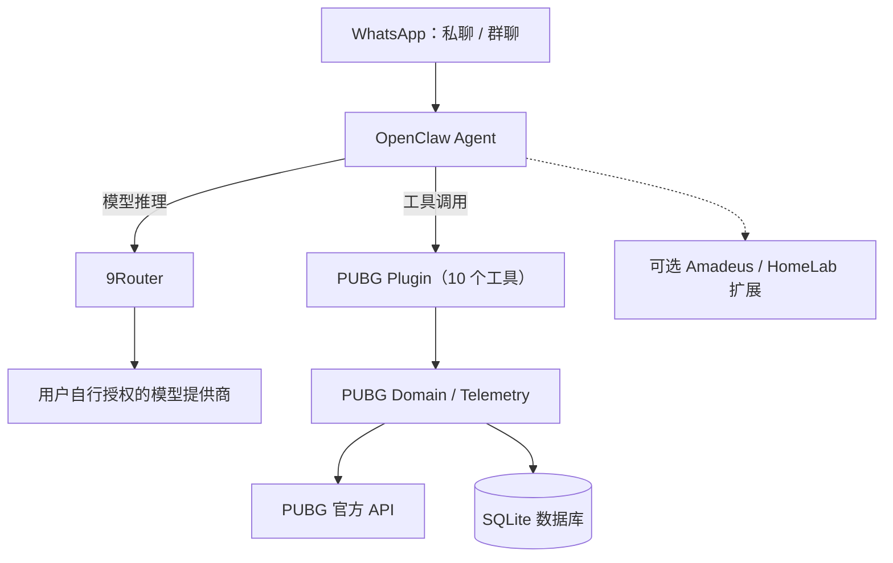

# Amadeus Home

**WhatsApp-first · Self-hosted AI assistant powered by OpenClaw + 9Router**

[](https://github.com/ChristmasFox/amadeus-home/actions/workflows/community-pubg-onboarding.yml)

> **🚧 社区预览版 / Community Preview**
>
> 源码已公开，PUBG 小队初始化与独立 Docker Compose 配置已加入，但尚未完成全新 Linux 主机的镜像构建、真实 WhatsApp/PUBG/9Router 端到端验收、完整历史隐私审计和许可证确认。请不要把当前版本理解为已验证的一键生产部署。
>
> **原生产环境维护者：** 本次更新把个人 9Router 生图账号白名单移出了 Git。更新本地仓库及下一次生产部署前，务必阅读 [私有账号策略迁移](docs/PRODUCTION_9ROUTER_POLICY_MIGRATION.md)，避免因缺少本地策略文件而导致部署拒绝。

## 从 PUBG 战绩机器人开始

和朋友打 PUBG，最常遇到的问题就是：**谁踢了队友？伤害打了多少？这周谁最能打？**

Amadeus Home 让你在 WhatsApp 私聊或群聊里直接提出问题。它从 PUBG 官方 API 和比赛 Telemetry 获取事实，再借助 OpenClaw 和模型生成易读的战绩分析。

> “查询昨天的小队战绩。”
>
> “这周谁的 KD 最高？谁对队友造成的伤害最多？”
>
> “总结上一场比赛的踢人、救援和队伍表现。”

上述是功能示例，不是来自实时公开演示环境的截图。

### 能做什么

| 模块 | 功能 | 社区默认 |
| --- | --- | --- |
| **PUBG Stats** | 小队/个人战绩、KD、排行、伤害、击倒、救援、Telemetry、友伤和趣味复盘 | ✅ |
| **WhatsApp** | 自然语言私聊/群聊查询、配对与群组访问控制 | ✅ |
| **OpenClaw** | Agent 会话、工具调用、自然语言理解 | ✅ |
| **9Router** | 自有模型账号及 API Key 聚合、模型组合、路由与 Fallback | ✅ |
| Telegram | 备用聊天渠道 | 可选 |
| **Amadeus Extensions** | HomeLab、NAS、通知、语音、生图、Product Radar 等 | 按需启用，**不包含在最小社区镜像中** |

PUBG 统计由确定性 Domain 完成；AI 负责理解你的问题与组织回复。**PUBG API 不经过 9Router**，后者负责 OpenClaw 的模型调用。

## 系统架构



## 快速开始：WhatsApp + 9Router + PUBG

### 环境要求

Docker Compose v2、Node.js 24+、你自己的 [PUBG Developer API Key](https://developer.pubg.com/)、可合法使用的模型账号或 API Key，以及用于扫码登录的 WhatsApp 账号。

**无需** Mac mini、CasaOS、OrbStack、公网域名或 Meta Cloud API Webhook。推荐给机器人单独准备 WhatsApp 号码。

### 1. 初始化独立的社区配置

```bash
git clone https://github.com/ChristmasFox/amadeus-home.git
cd amadeus-home
node scripts/init-community.mjs --model YOUR_CHAT_MODEL
```

将 `YOUR_CHAT_MODEL` 改为你准备在 9Router 中配置的模型或 Combo ID。脚本在 Git 忽略的本地目录生成随机网关凭据和最小权限 OpenClaw 配置，不会复制作者的生产数据，不会覆盖已有文件。

### 2. 启动 9Router

```bash
docker compose --env-file infra/community/.env \
  -f infra/community/compose.yaml up -d --build nine-router
```

通过 **http://127.0.0.1:20128** 登录。初始密码位于你本机的 `infra/community/.env`。连接**你自己授权的**模型服务，创建第 1 步所用的模型 ID，并生成单独的 9Router API Key。

把这个 Key 写入本地 `infra/community/.env` 的 `OPENCLAW_9ROUTER_API_KEY` 字段。不要把模型 Token、OAuth 凭据或这个文件提交到仓库。

社区镜像**没有指定账号的生图邮箱白名单**，但这不代表绕过上游授权或允许匿名使用；建议为模型设置额度和速率限制。

### 3. 输入昵称，初始化自己的 PUBG 小队

用本地编辑器把 PUBG API Key 存入 `.local/pubg-api-key`，然后执行：

```bash
node scripts/init-pubg-team.mjs \
  --players PlayerOne,PlayerTwo,PlayerThree,PlayerFour \
  --platform steam \
  --team-id my_squad \
  --label "我的开黑小队" \
  --api-key-file .local/pubg-api-key
```

程序会从官方 PUBG API 解析游戏昵称，并生成 Git 忽略的 `.local/pubg-team.json`。

这里的 **`team.id` 是本地自定义 ID**，不是 PUBG 官方分配的小队 ID；每位玩家的 `players[].id` 才是官方 Account ID。WhatsApp 发送者与 PUBG 账号是另一层身份关联，“我的战绩”等第一人称查询需要单独绑定身份。

### 4. 启动 OpenClaw 并连接 WhatsApp

```bash
docker compose --env-file infra/community/.env \
  -f infra/community/compose.yaml --profile pubg up -d --build

docker compose --env-file infra/community/.env \
  -f infra/community/compose.yaml --profile pubg \
  exec openclaw node dist/index.js channels login --channel whatsapp
```

手机扫描二维码即可开始配对。社区配置默认 **私聊 Pairing、群聊禁用、最小工具权限**。群聊需要你手动启用白名单、指定群组，并推荐要求 @机器人 后才触发。

更完整的安装、配对和排障说明请阅读：

- [社区 Docker 部署指南](infra/community/README.md)
- [PUBG 小队初始化与身份绑定](docs/COMMUNITY_PUBG_SETUP.md)

## 安全和隐私

| 领域 | 社区发行默认值 |
| --- | --- |
| 管理端口 | 9Router 和 OpenClaw 均只暴露到 `127.0.0.1` |
| WhatsApp 私聊 | 首次配对授权 |
| WhatsApp 群聊 | 默认关闭，明确白名单后才启用 |
| OpenClaw | 最小权限，仅额外开放 PUBG 工具 |
| 模型与游戏密钥 | 用户自备，存储在被忽略的本地文件或独立 Docker 数据卷 |
| 原生产账号隔离 | 独立的私有文件，社区镜像不包含个人账号信息 |

**重要：Git 历史仍可能包含早期的玩家标识与个人部署拓扑。** 当前文件的脱敏不等于历史已完成审计。请勿在 Issues、日志或截图中公开 Token、手机号/JID、账号 ID、域名和私有配置信息。

完整安全与发布清单：[Community Privacy & Release Gate](docs/COMMUNITY_PRIVACY_RELEASE_GATE.md)。

## 开发与扩展

```bash
corepack enable
pnpm install --frozen-lockfile
pnpm build:pubg
pnpm typecheck:pubg
pnpm test:pubg
node --test scripts/test-init-community.mjs
node --test scripts/test-init-pubg-team.mjs
node infra/docker/casaos/9router/test-runtime-policy.mjs
pnpm check:secrets
```

| 源码目录 | 用途 |
| --- | --- |
| [`plugins/pubg/`](plugins/pubg/) | 10 个 OpenClaw PUBG 工具 |
| [`packages/pubg-domain/`](packages/pubg-domain/) | PUBG API、SQLite、统计与 Telemetry |
| [`packages/identity/`](packages/identity/) | 身份与外部游戏账号绑定 |
| [`packages/presentation/`](packages/presentation/) | 多渠道结果展示 |
| [`infra/community/`](infra/community/) | 社区 Docker / 9Router 模型路由 / 安全默认配置 |
| [`integrations/openclaw/`](integrations/openclaw/) | OpenClaw 集成 |
| [`plugins/amadeus/`](plugins/amadeus/) | 个人 HomeLab 的扩展插件 |

**生产环境维护者**：请查看 [OpenClaw 运维文档](integrations/openclaw/README.md)、[9Router 维护文档](infra/9router/README.md) 和 [私有策略迁移指南](docs/PRODUCTION_9ROUTER_POLICY_MIGRATION.md)。社区用户不要执行个人生产的 `--apply` 部署脚本。

## 状态、反馈与许可

欢迎通过 [GitHub Issues](https://github.com/ChristmasFox/amadeus-home/issues) 提交功能想法与脱敏后的错误信息。

仍待完成：全新 Linux amd64/arm64 的镜像构建与实测、真实 WhatsApp + 9Router + PUBG 端到端验收、Git 历史安全检查、发行许可证以及脱敏战报截图。

**License：目前尚未添加正式开源许可证。** 代码可以查看，但在正式确定并加入 LICENSE 之前，请不要假定拥有再分发或商业使用许可。

---

*El Psy Kongroo.*
